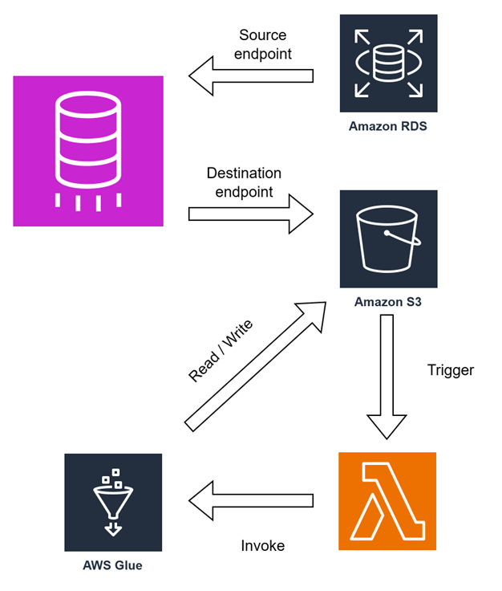
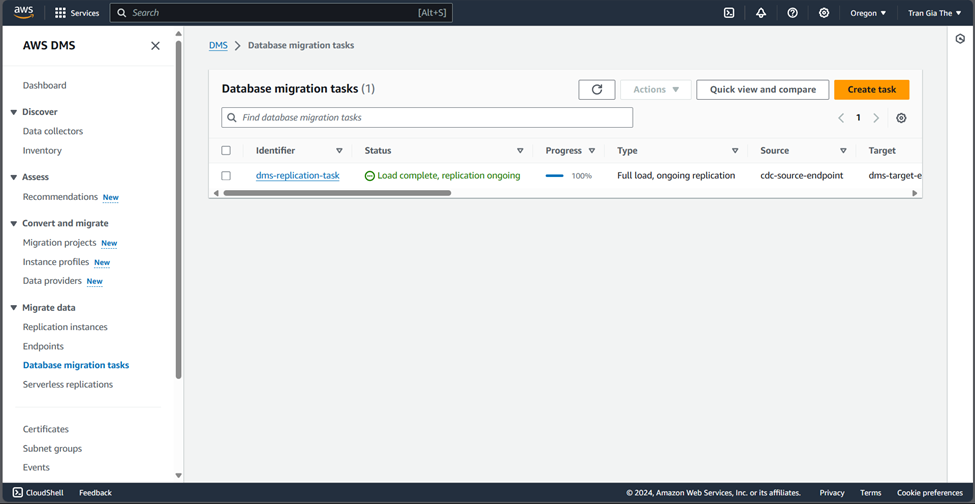
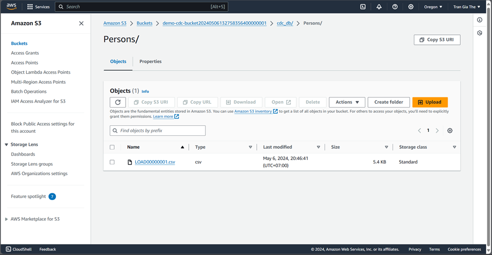
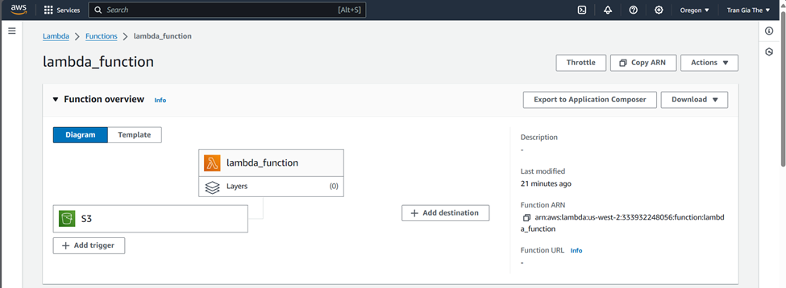
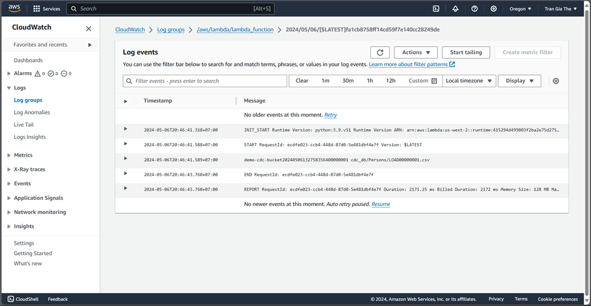
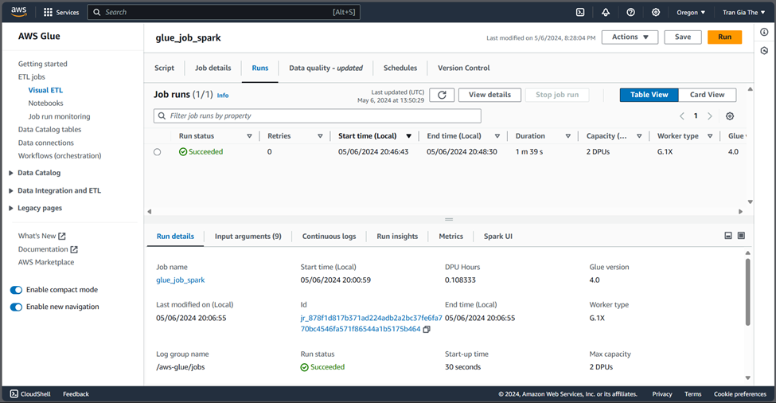
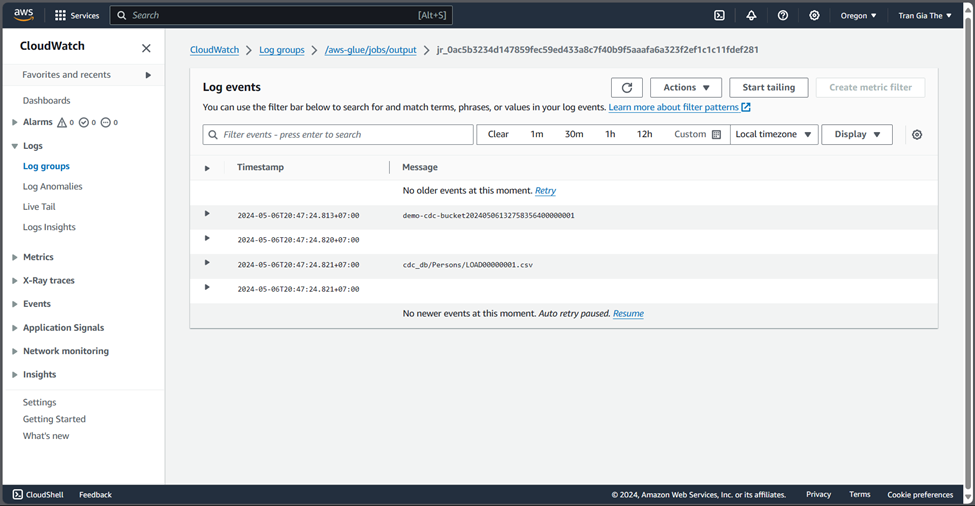
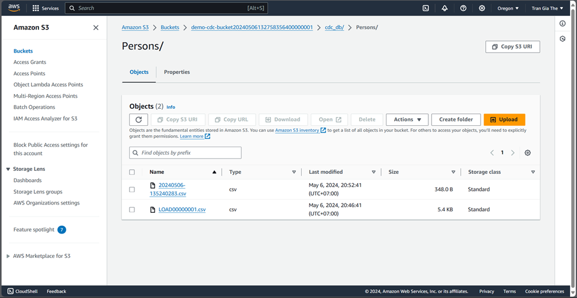

# CDC Project with Terraform

This project aims to deploy a Change Data Capture (CDC) solution using Terraform. The CDC solution utilizes AWS services such as AWS Database Migration Service (DMS), Amazon S3, AWS Lambda, and AWS Glue.

## Prerequisites

Before getting started, make sure you have the following prerequisites installed:

- Terraform: [Installation Guide](https://learn.hashicorp.com/tutorials/terraform/install-cli)
- AWS CLI: [Installation Guide](https://docs.aws.amazon.com/cli/latest/userguide/cli-configure-quickstart.html)

## Deployment Steps

1. Clone the repository:

   ```bash
   git clone https://github.com/your-username/project-big-data.git
   ```

2. Navigate to the project directory:

   ```bash
   cd project-big-data/cdc_project
   ```

3. Initialize Terraform:

   ```bash
   terraform init
   ```

4. Configure your AWS credentials:

   ```bash
   aws configure
   ```

5. Modify the `variables.tf` file to customize your deployment settings.

6. Deploy the infrastructure:

   ```bash
   terraform apply
   ```

7. Monitor the deployment progress and wait for it to complete. This process may take up to 10 minutes.

## Architecture Overview

The CDC project architecture consists of the following components:

- **AWS Database Migration Service (DMS):** Used to migrate data from the source database to Amazon S3.

- **Amazon S3:** Serves as the storage for the migrated data and the output files generated by AWS Glue.

- **AWS Lambda:** Triggers AWS Glue when DMS migrates data to Amazon S3.

- **AWS Glue:** Handles the data transformation and processing jobs, and saves the output files back to Amazon S3.

<div align="center">

</div>

## Monitoring and logging

- **AWS DMS and Amazon S3:**
  - Check AWS DMS UI and S3 UI to verify that the data has been successfully migrated to S3.
  <div align="center">
  
  
  </div>
- **AWS Lambda:**
  - Lambda function executions and any print statements will be logged in AWS CloudWatch. Go to the Lambda UI and select monitor to access AWS CloudWatch logs.

<div align="center">


</div>

- **AWS Glue:**
  - After lambda function execution, navigate to the Glue UI to see running jobs. Glue job logs can be found in AWS CloudWatch.

<div align="center">


</div>

- **Data Update Cycle:**
  - Whenever there are insertions, updates, or deletions, DMS will migrate that data to S3, initiating the cycle again.

<div align="center">

</div>

## Teardown

When you're done, you can destroy the resources created by Terraform.

```bash
terraform destroy
```
